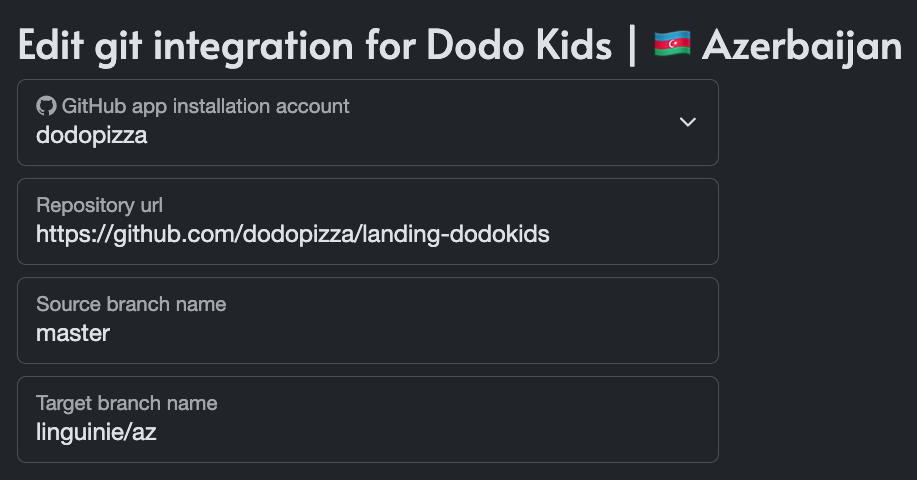

# Landing template

Этот шаблон разработан для быстрого разворачивания и настройки лендинговых страниц на базе Astro.

## Содержание

- [Подготовка](#подготовка)
- [Установка](#установка)
- [Команды проекта](#команды-проекта)
- [Структура проекта](#структура-проекта)
- [Алиасы](#алиасы)
- [Написание стилей](#написание-стилей)
- [Деплой](#деплой)
- [UI Kit](#ui-kit)
- [Мультиязычность](#мультиязычность)
- [Полезные ссылки](#полезные-ссылки)

## Подготовка
### Node.js версия:
[LTS `22`](https://nodejs.org/en/about/previous-releases#release-schedule)

Рекомендуем использовать [nvm](https://github.com/nvm-sh/nvm) для удобной работы с разными версиями Node.js.

### Пакетный менеджер:
`yarn@4.^5.1`.
## Установка

Копировать репозиторий:

```bash
git clone https://github.com/your-repo/your-template.git
cd /your-repo
```

Установить зависимости:
```bash
yarn install
```

## Команды проекта

| Command                | Action                                                         |
|:-----------------------|:---------------------------------------------------------------|
| `yarn dev`             | Запустить локальный dev сервер (по-умолчанию `localhost:4321`) |
| `yarn build`           | Сборка проекта в директорию `./dist/`                          |
| `yarn preview`         | Превью билд версии                                             |
| `yarn astro ...`       | Запуск команды на примере `astro add`, `astro check`           |
| `yarn astro -- --help` | Дополнительная информация                                      |


## Структура проекта

```
├── public/...
├── src/
│   ├── assets/            # Статические файлы (изображения, иконки и т.д.)
│   ├── components/        # React и Astro компоненты
│   ├── layouts/           # Базовый шаблон страниц
│   └── pages/             # Страницы
├── astro.config.mjs
├── tailwind.config.mjs
├── tsconfig.json
├── package.json
└── README.md
```

[Подробнее о структуре проекта Astro](https://docs.astro.build/en/basics/project-structure/)

## Алиасы
Используй ранее созданные алиасы для импортов в `.astro` и `.tsx` файлах + при необходимости [расширь список](https://www.typescriptlang.org/tsconfig/#paths) в `tsconfig.json`.

### Доступные алиасы
- `~/pages/*` — для страниц
- `~/layouts/*` — для базовых шаблонов страниц
- `~/components/*` — для компонентов
- `~/assets/*` — для статических файлов

## Написание стилей
## Использование tw-merge в проекте с Tailwind CSS

Tailwind CSS предоставляет огромные возможности для стилизации компонентов, но иногда количество стилей может стать трудноуправляемым. Чтобы облегчить работу с Tailwind, мы используем библиотеку `tw-merge` для логической группировки стилей. Это помогает избежать дублирования классов и улучшить читаемость кода.

### Правила использования tw-merge

1. **Базовые и общие стили**: Помещайте базовые стили в начале. Эти стили будут применяться к компоненту по умолчанию.
2. **Мобильные стили**: Следующие стили будут применяться для мобильных устройств. Используйте медиазапросы Tailwind для указания стилей для мобильных устройств.
3. **Стили для других разрешений**: Добавьте стили для планшетов, десктопов и больших экранов. Используйте соответствующие медиазапросы Tailwind.
4. **Псевдоклассы**: Последними добавляйте стили для псевдоклассов, таких как `:hover`, `:focus`, `:active` и т.д.

### Пример использования
Для написания стилей в проекте используется [Tailwind](https://tailwindcss.com/) в связке с классическим `scss` препроцессором. 

### Правила группирировки стилей

1. **Базовые и общие стили**: Помещайте базовые стили в начале. Эти стили будут применяться к компоненту по умолчанию.
2. **Мобильные/таблет/десктоп стили**: Эти стили будут применяться для конкретных медиаразрешений.
3. **Стили позиционирования**: Стили для абсолютного позиционирования с использованием.
4. **Псевдоклассы**: Последними добавляйте стили для псевдоклассов, таких как `:hover`, `:focus`, `:active` и т.д.

### Способ 1
C использованием scss модулей.
Для типизации модулей используется библиотека [typescript-plugin-css-modules](https://www.npmjs.com/package/typescript-plugin-css-modules).

### Способ 2
С написанием стилей в компонентах.

### Пример использования:
```tsx
<button
    className={
        twMerge(
            "flex-1 text-sm text-neutral-400 text-center bg-neutral-200 leading-snug whitespace-nowrap",
            "rounded-lg py-2 px-3",
            "md:rounded-xl md:py-3 md:px-4",
            "hover:bg-neutral-500 hover:text-white transition-colors",
        )
    }
    onClick={onAccept}
>
    Применить
</button>
```

## Деплой
По умолчанию деплой настроен на публикацию артефакта в GitHub Pages. 

В `astro.config.js` необходимо указать название профиля и базовый `url` под названием репозитория

```js
export default defineConfig({
    site: 'https://example-profile.github.io',
    base: 'example-project-name',
    // другие настройки...    
});
```

[Подробнее о настройках](https://docs.astro.build/en/guides/deploy/github/).

## UI Kit
[Базовый UI Kit](https://www.figma.com/design/V1c5n13I5RCxgbb9jnbCi2/UI-Kit?m=auto&t=GsxSjs5QRBXR762o-6), который необходимо расширить.

## Мультиязычность

### Порядок работы
1. Создайте `index.json` файл в папке `.src/translations` и задайте все необходимы ключи и запушьте изменения.
2. Создайте отдельную ветку в формате `<группа_переводов>/<язык>`.
Пример для Азербайджана: `linguinie/az`.
3. Создайте в [Linguinie](https://linguine.dodois.io) проект с отдельной языковой меткой (_прим. "Dodo Kids | 🇦🇿 Azerbaijan"_).
4. Настройте на источник `Source branch name` главную ветку, а ветку языка ранее созданную (_прим. `linguinie/az`_).

5. Добавьте нужные локали и переводы в Linguinie и сделай экспорт.
6. Запустите из вашей рабочей ветки `yarn sync:trans` для синхронизации папки с переводами.


## Конфигурация

Для настройки скрипта необходимо использовать конфигурационный объект следующего вида:

```typescript
const config: ConfigTranslationSync = {
    source: './src/translation', // Исходный источник, куда будут загружаться все переводы
    languages: [
        {
            branch: 'linguinie/az', // Имя ветки, откуда будут взяты переводы
            name: 'azerbaijan', // Имя папки, куда будут помещены переводы
            exclude: ['index.json'], // Файлы, которые необходимо исключить из синхронизации
            locales: 'all', // Локали для синхронизации (все или указанные)
        },
        ...
    ]
};
```

## Полезные ссылки
[Landings | BuildIn](https://buildin.ai/share/7c1ac542-1c26-4732-9123-a96ec05fc5d4?code=J49CED)
[Landing workflow | Miro](https://miro.com/app/board/uXjVP5B9qYo=/)
[Landing template | GitHub](https://github.com/Sinoptik93/landing-template)
