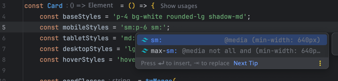

# Landing template

Этот шаблон разработан для быстрого разворачивания и настройки лендинговых страниц на базе Astro.

## Содержание

- [Подготовка](#подготовка)
- [Установка](#установка)
- [Команды проекта](#команды-проекта)
- [Структура проекта](#структура-проекта)
- [Алиасы](#алиасы)
- [Написание стилей](#написание-стилей)
- [Деплой](#деплой)
- [UI Kit](#ui-kit)
- [Мультиязычность](#мультиязычность)
- [Полезные ссылки](#полезные-ссылки)

## Подготовка
Версия Node.js: LTS `20` (_скоро будет 22_)

Проверка версии:

````bash 
node -v
````

## Установка

Копировать репозиторий:

```bash
git clone https://github.com/your-repo/your-template.git
cd /your-repo
```

Установить зависимости:
```bash
yarn install
```

## Команды проекта

| Command                | Action                                               |
|:-----------------------|:-----------------------------------------------------|
| `yarn dev`             | Запустить локальный dev сервер на `localhost:4321`   |
| `yarn build`           | Сборка проекта в директорию `./dist/`                |
| `yarn preview`         | Превью версия сборки                                 |
| `yarn astro ...`       | Запуск команды на примере `astro add`, `astro check` |
| `yarn astro -- --help` | Дополнительная информация                            |


## Структура проекта

```
├── public/
│   └── assets/            # Статические файлы (изображения, иконки и т.д.)
├── src/
│   ├── components/        # React и Astro компоненты
│   ├── layouts/           # Базовый шаблон страниц
│   └── pages/             # Страницы
├── astro.config.mjs
├── tailwind.config.mjs
├── tsconfig.json
├── package.json
└── README.md
```

[Подробнее о структуре проекта Astro](https://docs.astro.build/en/basics/project-structure/)

## Алиасы
Используй ранее созданные алиасы для импортов в `.astro` и `.tsx` файлах + при необходимости [расширь список](https://www.typescriptlang.org/tsconfig/#paths) в `tsconfig.json`.

### Доступные алиасы
- `~/pages/*` — для страниц
- `~/layouts/*` — для базовых шаблонов страниц
- `~/components/*` — для компонентов
- `~/assets/*` — для статических файлов

## Написание стилей
## Использование tw-merge в проекте с Tailwind CSS

Tailwind CSS предоставляет огромные возможности для стилизации компонентов, но иногда количество стилей может стать трудноуправляемым. Чтобы облегчить работу с Tailwind, мы используем библиотеку `tw-merge` для логической группировки стилей. Это помогает избежать дублирования классов и улучшить читаемость кода.

### Правила использования tw-merge

1. **Базовые и общие стили**: Помещайте базовые стили в начале. Эти стили будут применяться к компоненту по умолчанию.
2. **Мобильные стили**: Следующие стили будут применяться для мобильных устройств. Используйте медиазапросы Tailwind для указания стилей для мобильных устройств.
3. **Стили для других разрешений**: Добавьте стили для планшетов, десктопов и больших экранов. Используйте соответствующие медиазапросы Tailwind.
4. **Псевдоклассы**: Последними добавляйте стили для псевдоклассов, таких как `:hover`, `:focus`, `:active` и т.д.

### Пример использования
Для написания стилей в проекте используется [Tailwind](https://tailwindcss.com/) в связке с классическим `scss` препроцессором. 

### Правила группирировки стилей

1. **Базовые и общие стили**: Помещайте базовые стили в начале. Эти стили будут применяться к компоненту по умолчанию.
2. **Мобильные/таблет/десктоп стили**: Эти стили будут применяться для конкретных медиаразрешений.
3. **Стили позиционирования**: Стили для абсолютного позиционирования с использованием.
4. **Псевдоклассы**: Последними добавляйте стили для псевдоклассов, таких как `:hover`, `:focus`, `:active` и т.д.

### Способ 1.1
С написанием стилей в компонентах.

### Пример использования:
```tsx
<button
    className={
        twMerge(
            "flex-1 text-sm text-neutral-400 text-center bg-neutral-200 leading-snug whitespace-nowrap",
            "rounded-lg py-2 px-3",
            "md:rounded-xl md:py-3 md:px-4",
            "hover:bg-neutral-500 hover:text-white transition-colors",
        )
    }
    onClick={onAccept}
>
    Применить
</button>
```

### Способ 1.2
С отдельным написанием стилей.

### Автоподстановка стилей в компоненте
Нужно добавить в настройки плагина Tailwind вашей IDE  в раздел `tailwindCSS.experimental.classRegex` следующую строчку

```
"tailwindCSS.experimental.classRegex": [
    // Позволит получать подсказки для стилей в формате const xxxStyles = "..."
    "const\\s+\\w+Styles\\s+=\\s+['\"]([^'\"]*)['\"]" 
  ]
```

### Пример подсказок:


### Пример использования компоненты:
```tsx
import { twMerge } from 'tailwind-merge';

const Card = () => {
    const baseStyles = 'bg-white rounded-lg shadow-md';
    const mobileStyles = 'p-6';
    const tabletStyles = 'md:p-8';
    const desktopStyles = 'lg:p-10';
    const hoverStyles = 'hover:bg-gray-100';
    
    const cardClasses = twMerge(
        baseStyles,
        mobileStyles,
        tabletStyles,
        desktopStyles,
        hoverStyles
    );

    return (
        <div className={cardClasses}>
            <h2 className="text-xl font-bold">Card Title</h2>
            <p className="text-gray-700">This is a card component with responsive styles.</p>
        </div>
    );
};

export default Card;
```

### Способ 3

С использованием [Linaria](https://linaria.dev/).

```tsx
import {css} from '@linaria/core';

const GLOBAL_VARS = {
    color_header: 'red',
} as const;

export default function CSRComponent() {
    return (
        <div>
            <h1>
                Hello! This is 
                <strong
                    class={css`
                        color: ${GLOBAL_VARS.color_header};
                    `}
                >Anton</strong>
            </h1>
        </div>
    );
}
```

[Интеграция Astro и Linaria](https://github.com/callstack/linaria/blob/master/examples/astro-solid/pages/csr.tsx)

## Деплой
По умолчанию деплой настроен на публикацию артефакта в GitHub Pages. 

В `astro.config.js` необходимо указать название профиля и базовый `url` под названием репозитория

```js
export default defineConfig({
    site: 'https://example-profile.github.io',
    base: 'example-project-name',
    // другие настройки...    
});
```

[Подробнее о настройках](https://docs.astro.build/en/guides/deploy/github/).

## UI Kit
Если TW - [Базовый UI Kit](https://www.figma.com/design/V1c5n13I5RCxgbb9jnbCi2/UI-Kit?m=auto&t=GsxSjs5QRBXR762o-6), который необходимо расширить.

## Мультиязычность
?

## Полезные ссылки
?
